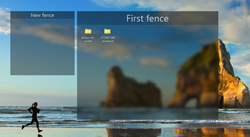

# FancesStardock

 1. Agradecimento ao [Twometer](https://github.com/Twometer) que iniciou esse belo projeto base do qual uso bastante.

 2. Quero agradecer também a um aamigo e parceiro [vandermjr](https://github.com/vandermjr) que graças e ele nós ultimos meses eu aprendi muitas coisas sobre a a linguagem de programação C# (Apesar de ja programar em VB a anos)
 3. Desenvolvimento de novos recursos, melhorias, correções, entre outros, por[[wesllemsilva1985](https://github.com/wesllemsilva1985)
## Colaboradores:

 4. [vandermjr](https://github.com/vandermjr)

# Este projeto esta se iniciando no dia de hoje 15/12/2022

 + O projeto é aberto e todos que estiverem a fim de ajudar, serão bem vindos.
 + O projeto se trata de um Stardock para área de trabalho do windows para organização de arquivos, pastas, documentos e etc.
 + 

>** 
> **Linguagem de programação e outros:**
> CSharp (C#) versão 10
> Tipo de projeto em Net Frameworks 4.8
> o projeto não tem nenhuma depêndencia ate o momento

 **- Probabilidade futura da migração para o Net 6**

## Screen Shot
+ Primeira tela 
+ 

